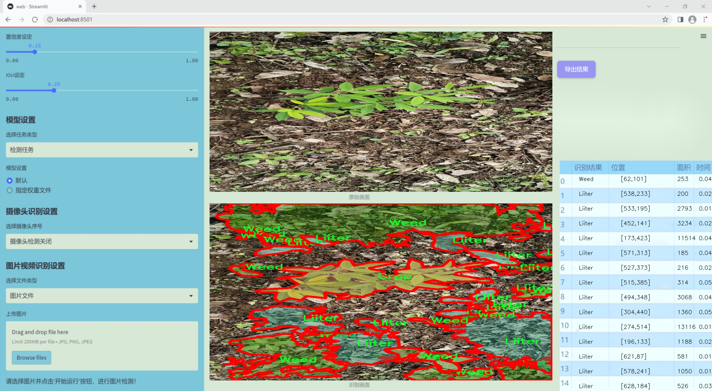
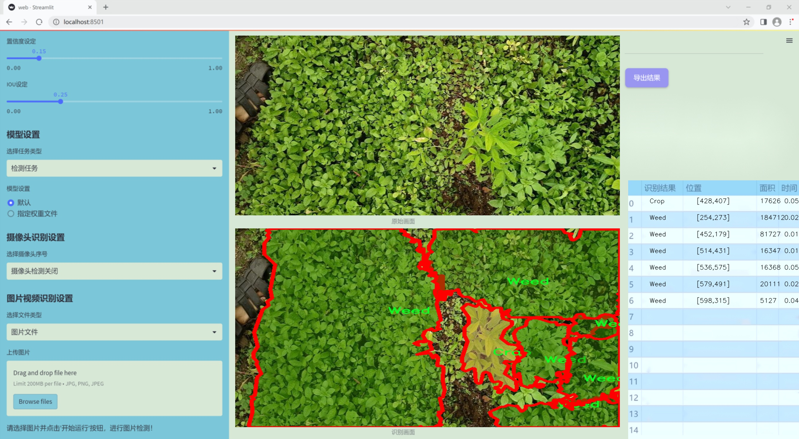
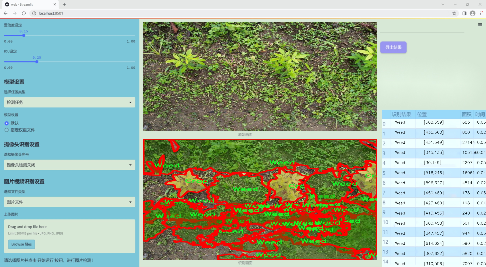
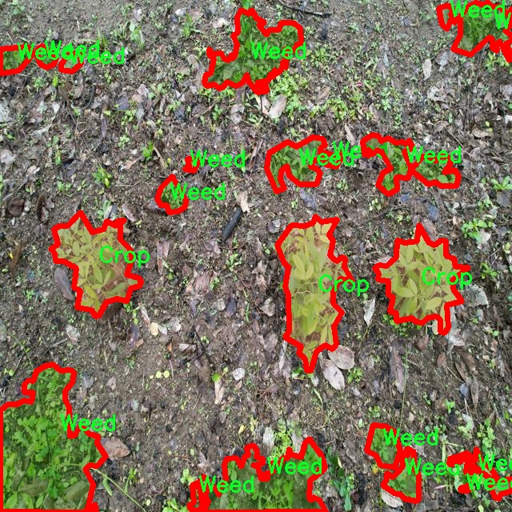
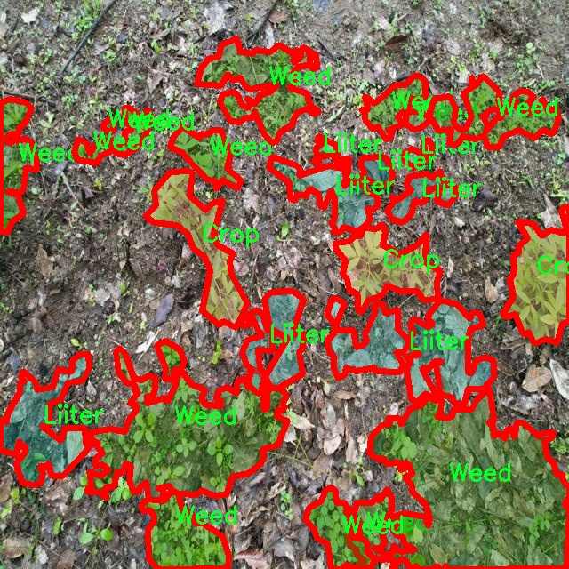
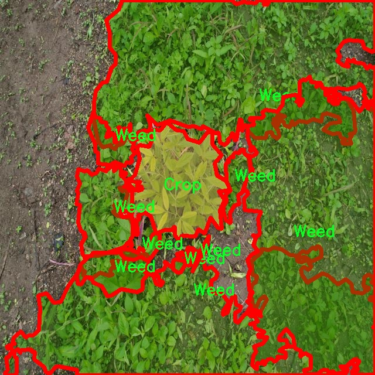
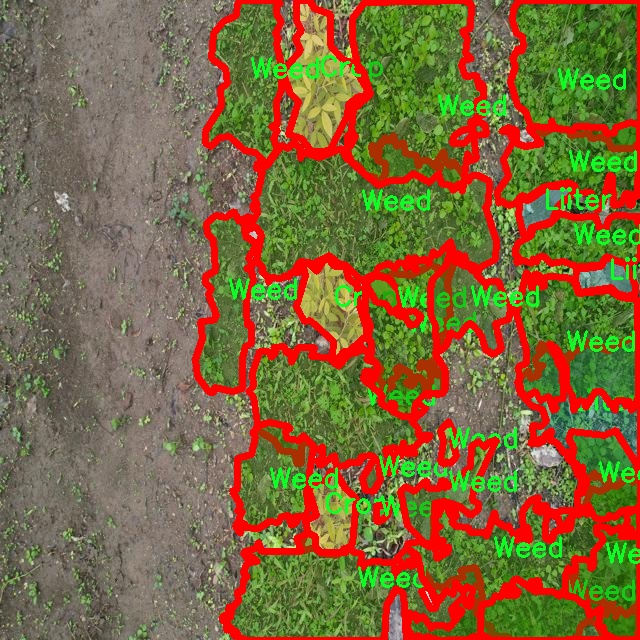
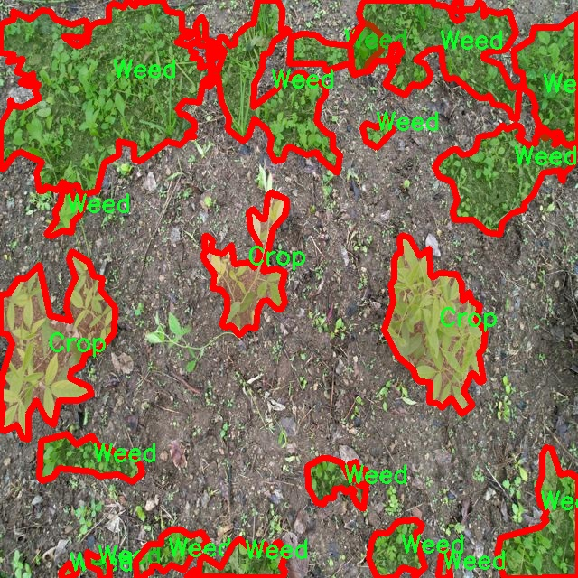

### 1.背景意义

研究背景与意义

随着全球人口的不断增长，农业生产面临着前所未有的挑战。如何提高农作物的产量和质量，成为了现代农业研究的重要课题。在这一背景下，智能农业技术的应用逐渐受到重视，尤其是计算机视觉技术在农作物监测和管理中的潜力愈发显现。传统的人工识别方法不仅耗时耗力，而且容易受到人为因素的影响，难以保证识别的准确性和一致性。因此，开发高效、准确的农作物及杂草识别系统，成为了提升农业生产效率的重要手段。

本研究旨在基于改进的YOLOv11模型，构建一个高效的农作物及杂草识别系统。该系统将利用CWD400-800数据集，该数据集包含1100幅图像，涵盖农作物、杂草及其他相关类别，具备较为丰富的多样性和代表性。通过对该数据集的深度学习训练，期望能够实现对农作物与杂草的高精度识别与分类，从而为农业管理提供科学依据。

此外，随着环境保护意识的增强，精准农业的理念逐渐深入人心。通过自动化的识别系统，农民可以更有效地进行杂草管理，减少化学除草剂的使用，降低对环境的影响。这不仅有助于提高农作物的产量和质量，还能推动可持续农业的发展。因此，基于改进YOLOv11的农作物及杂草识别系统的研究，不仅具有重要的学术价值，也为实际农业生产提供了切实可行的解决方案。通过该系统的推广应用，期望能够推动农业生产方式的转变，实现农业的智能化与可持续发展。

### 2.视频效果

[2.1 视频效果](https://www.bilibili.com/video/BV1uUqqYxEDn/)

### 3.图片效果







##### [项目涉及的源码数据来源链接](https://kdocs.cn/l/cszuIiCKVNis)**

注意：本项目提供训练的数据集和训练教程,由于版本持续更新,暂不提供权重文件（best.pt）,请按照6.训练教程进行训练后实现上图演示的效果。

### 4.数据集信息

##### 4.1 本项目数据集类别数＆类别名

nc: 3
names: ['Crop', 'Liiter', 'Weed']


该项目为【图像分割】数据集，请在【训练教程和Web端加载模型教程（第三步）】这一步的时候按照【图像分割】部分的教程来训练

##### 4.2 本项目数据集信息介绍

本项目数据集信息介绍

本项目所使用的数据集名为“CWD400-800”，旨在为改进YOLOv11的农作物及杂草识别系统提供高质量的训练数据。该数据集专注于农业领域，特别是作物与杂草的识别与分类，具有重要的实际应用价值。数据集中包含三种主要类别，分别为“Crop”（作物）、“Liiter”（杂草）和“Weed”（杂草），这些类别的划分有助于系统在复杂的农业环境中准确识别和区分不同的植物种类。

在数据集的构建过程中，研究团队收集了大量的图像数据，这些图像涵盖了不同生长阶段、不同光照条件以及不同气候环境下的作物和杂草。这种多样性确保了模型在训练过程中能够学习到丰富的特征，从而提高其在实际应用中的泛化能力。数据集中的每一张图像都经过精心标注，确保每个类别的植物在图像中清晰可辨，标注的准确性直接影响到模型的训练效果和识别精度。

此外，数据集还考虑到了不同作物与杂草的生长特征，提供了丰富的背景信息，使得模型不仅能够识别植物的形态特征，还能理解其生长环境。这种综合性的训练数据将极大地提升YOLOv11在农作物及杂草识别任务中的表现，帮助农民和农业工作者更有效地管理作物生长和杂草控制，从而实现更高的农业生产效率和可持续发展目标。通过对“CWD400-800”数据集的深入分析与应用，本项目期待能够推动农业智能化的发展，为现代农业提供更为精准的技术支持。











### 5.全套项目环境部署视频教程（零基础手把手教学）

[5.1 所需软件PyCharm和Anaconda安装教程（第一步）](https://www.bilibili.com/video/BV1BoC1YCEKi/?spm_id_from=333.999.0.0&vd_source=bc9aec86d164b67a7004b996143742dc)


[5.2 安装Python虚拟环境创建和依赖库安装视频教程（第二步）](https://www.bilibili.com/video/BV1ZoC1YCEBw?spm_id_from=333.788.videopod.sections&vd_source=bc9aec86d164b67a7004b996143742dc)

### 6.改进YOLOv11训练教程和Web_UI前端加载模型教程（零基础手把手教学）

[6.1 改进YOLOv11训练教程和Web_UI前端加载模型教程（第三步）](https://www.bilibili.com/video/BV1BoC1YCEhR?spm_id_from=333.788.videopod.sections&vd_source=bc9aec86d164b67a7004b996143742dc)


按照上面的训练视频教程链接加载项目提供的数据集，运行train.py即可开始训练



     Epoch   gpu_mem       box       obj       cls    labels  img_size
     1/200     20.8G   0.01576   0.01955  0.007536        22      1280: 100%|██████████| 849/849 [14:42<00:00,  1.04s/it]
               Class     Images     Labels          P          R     mAP@.5 mAP@.5:.95: 100%|██████████| 213/213 [01:14<00:00,  2.87it/s]
                 all       3395      17314      0.994      0.957      0.0957      0.0843

     Epoch   gpu_mem       box       obj       cls    labels  img_size
     2/200     20.8G   0.01578   0.01923  0.007006        22      1280: 100%|██████████| 849/849 [14:44<00:00,  1.04s/it]
               Class     Images     Labels          P          R     mAP@.5 mAP@.5:.95: 100%|██████████| 213/213 [01:12<00:00,  2.95it/s]
                 all       3395      17314      0.996      0.956      0.0957      0.0845

     Epoch   gpu_mem       box       obj       cls    labels  img_size
     3/200     20.8G   0.01561    0.0191  0.006895        27      1280: 100%|██████████| 849/849 [10:56<00:00,  1.29it/s]
               Class     Images     Labels          P          R     mAP@.5 mAP@.5:.95: 100%|███████   | 187/213 [00:52<00:00,  4.04it/s]
                 all       3395      17314      0.996      0.957      0.0957      0.0845


###### [项目数据集下载链接](https://kdocs.cn/l/cszuIiCKVNis)

### 7.原始YOLOv11算法讲解

YOLOv11是一种由Ultralytics公司开发的最新一代目标检测模型，以其增强的特征提取能力和更高的效率在计算机视觉领域引人注目。该模型在架构上进行了关键升级，通过更新主干和颈部结构，显著提高了对复杂视觉场景的理解和处理精度。YOLOv11不仅在目标检测上表现出色，还支持实例分割、图像分类、姿态估计和定向目标检测（OBB）等任务，展示出其多功能性。

与其前身YOLOv8相比，YOLOv11在设计上实现了深度和宽度的改变，同时引入了几个创新机制。其中，C3k2机制是对YOLOv8中的C2f的改进，提升了浅层特征的处理能力；C2PSA机制则进一步优化了特征图的处理流程。解耦头的创新设计，通过增加两个深度卷积（DWConv），提高了模型对细节的感知能力和分类准确性。

在性能上，YOLOv11m模型在COCO数据集上的平均精度（mAP）提高，并减少了22%的参数量，确保了在运算效率上的突破。该模型可以部署在多种平台上，包括边缘设备、云平台以及支持NVIDIA GPU的系统，彰显出卓越的灵活性和适应性。总体而言，YOLOv11通过一系列的创新突破，对目标检测领域产生了深远的影响，并为未来的开发提供了新的研究方向。


****文档**** ： _ _https://docs.ultralytics.com/models/yolo11/__

****代码链接**** ： _ _https://github.com/ultralytics/ultralytics__

******Performance Metrics******


​ ** **关键特性****

****◆**** ** **增强的特征提取能力**** ：YOLO11采用了改进的主干和颈部架构，增强了 ** **特征提取****
能力，能够实现更精确的目标检测和复杂任务的执行。

****◆**** ** **优化的效率和速度****
：YOLO11引入了精细化的架构设计和优化的训练流程，提供更快的处理速度，并在准确性和性能之间保持最佳平衡。

****◆**** ** **参数更少、精度更高****
：通过模型设计的改进，YOLO11m在COCO数据集上实现了更高的平均精度（mAP），同时使用的参数比YOLOv8m少22%，使其在计算上更加高效，而不牺牲准确性。

****◆**** ** **跨环境的适应性**** ：YOLO11可以无缝部署在各种环境中，包括边缘设备、云平台和支持NVIDIA
GPU的系统，确保最大的灵活性。

****◆**** ** **支持广泛任务****
：无论是目标检测、实例分割、图像分类、姿态估计还是定向目标检测（OBB），YOLO11都旨在应对一系列计算机视觉挑战。

****支持的任务和模式****


​YOLO11建立在YOLOv8中引入的多功能模型范围之上，为各种计算机视觉任务提供增强的支持:


​该表提供了YOLO11模型变体的概述，展示了它们在特定任务中的适用性以及与Inference、Validation、Training和Export等操作模式的兼容性。从实时检测到复杂的分割任务
，这种灵活性使YOLO11适用于计算机视觉的广泛应用。

##### yolov11的创新

■ yolov8 VS yolov11

YOLOv5，YOLOv8和YOLOv11均是ultralytics公司的作品，ultralytics出品必属精品。


​ **具体创新点** ：

**① 深度（depth）和宽度 （width）**

YOLOv8和YOLOv11是基本上完全不同。

**② C3k2机制**

C3k2有参数为c3k，其中在网络的浅层c3k设置为False。C3k2就相当于YOLOv8中的C2f。


​ **③ C2PSA机制**

下图为C2PSA机制的原理图。


​ **④ 解耦头**

解耦头中的分类检测头增加了两个 **DWConv** 。


▲Conv

    
    
    def autopad(k, p=None, d=1):  # kernel, padding, dilation
    
        """Pad to 'same' shape outputs."""
    
        if d > 1:
    
            k = d * (k - 1) + 1 if isinstance(k, int) else [d * (x - 1) + 1 for x in k]  # actual kernel-size
    
        if p is None:
    
            p = k // 2 if isinstance(k, int) else [x // 2 for x in k]  # auto-pad
    
    return p
    
    
    class Conv(nn.Module):
    
        """Standard convolution with args(ch_in, ch_out, kernel, stride, padding, groups, dilation, activation)."""
    
    
        default_act = nn.SiLU()  # default activation
    
    
        def __init__(self, c1, c2, k=1, s=1, p=None, g=1, d=1, act=True):
    
            """Initialize Conv layer with given arguments including activation."""
    
            super().__init__()
    
            self.conv = nn.Conv2d(c1, c2, k, s, autopad(k, p, d), groups=g, dilation=d, bias=False)
    
            self.bn = nn.BatchNorm2d(c2)
    
            self.act = self.default_act if act is True else act if isinstance(act, nn.Module) else nn.Identity()
    
    
        def forward(self, x):
    
            """Apply convolution, batch normalization and activation to input tensor."""
    
            return self.act(self.bn(self.conv(x)))
    
    
        def forward_fuse(self, x):
    
            """Perform transposed convolution of 2D data."""
    
            return self.act(self.conv(x))

▲Conv2d

    
    
    torch.nn.Conv2d(in_channels, out_channels, kernel_size, stride=1, padding=0, dilation=1, groups=1, bias=True, padding_mode='zeros')

▲DWConv

DWConv ** **代表 Depthwise Convolution（深度卷积）****
，是一种在卷积神经网络中常用的高效卷积操作。它主要用于减少计算复杂度和参数量。

    
    
    class DWConv(Conv):
    
        """Depth-wise convolution."""
    
    
        def __init__(self, c1, c2, k=1, s=1, d=1, act=True):  # ch_in, ch_out, kernel, stride, dilation, activation
    
            """Initialize Depth-wise convolution with given parameters."""
    
            super().__init__(c1, c2, k, s, g=math.gcd(c1, c2), d=d, act=act)


### 8.200+种全套改进YOLOV11创新点原理讲解

#### 8.1 200+种全套改进YOLOV11创新点原理讲解大全

由于篇幅限制，每个创新点的具体原理讲解就不全部展开，具体见下列网址中的改进模块对应项目的技术原理博客网址【Blog】（创新点均为模块化搭建，原理适配YOLOv5~YOLOv11等各种版本）

[改进模块技术原理博客【Blog】网址链接](https://gitee.com/qunmasj/good)


#### 8.2 精选部分改进YOLOV11创新点原理讲解

###### 这里节选部分改进创新点展开原理讲解(完整的改进原理见上图和[改进模块技术原理博客链接](https://gitee.com/qunmasj/good)【如果此小节的图加载失败可以通过CSDN或者Github搜索该博客的标题访问原始博客，原始博客图片显示正常】


### 空间和通道重建卷积SCConv
参考该博客提出的一种高效的卷积模块，称为SCConv (spatial and channel reconstruction convolution)，以减少冗余计算并促进代表性特征的学习。提出的SCConv由空间重构单元(SRU)和信道重构单元(CRU)两个单元组成。

（1）SRU根据权重分离冗余特征并进行重构，以抑制空间维度上的冗余，增强特征的表征。

（2）CRU采用分裂变换和融合策略来减少信道维度的冗余以及计算成本和存储。

（3）SCConv是一种即插即用的架构单元，可直接用于替代各种卷积神经网络中的标准卷积。实验结果表明，scconvo嵌入模型能够通过减少冗余特征来获得更好的性能，并且显著降低了复杂度和计算成本。


SCConv如图所示，它由两个单元组成，空间重建单元(SRU)和通道重建单元(CRU)，以顺序的方式放置。具体而言，对于瓶颈残差块中的中间输入特征X，首先通过SRU运算获得空间细化特征Xw，然后利用CRU运算获得信道细化特征Y。SCConv模块充分利用了特征之间的空间冗余和通道冗余，可以无缝集成到任何CNN架构中，以减少中间特征映射之间的冗余并增强CNN的特征表示。

#### SRU单元用于空间冗余


为了利用特征的空间冗余，引入了空间重构单元(SRU)，如图2所示，它利用了分离和重构操作。

分离操作 的目的是将信息丰富的特征图与空间内容对应的信息较少的特征图分离开来。我们利用组归一化(GN)层中的比例因子来评估不同特征图的信息内容。具体来说，给定一个中间特征映射X∈R N×C×H×W，首先通过减去平均值µ并除以标准差σ来标准化输入特征X，如下所示:


其中µ和σ是X的均值和标准差，ε是为了除法稳定性而加入的一个小的正常数，γ和β是可训练的仿射变换。

GN层中的可训练参数\gamma \in R^{C}用于测量每个批次和通道的空间像素方差。更丰富的空间信息反映了空间像素的更多变化，从而导致更大的γ。归一化相关权重W_{\gamma} \in R^{C}由下面公式2得到，表示不同特征映射的重要性。


然后将经Wγ重新加权的特征映射的权值通过sigmoid函数映射到(0,1)范围，并通过阈值进行门控。我们将阈值以上的权重设置为1，得到信息权重W1，将其设置为0，得到非信息权重W2(实验中阈值设置为0.5)。获取W的整个过程可以用公式表示。


最后将输入特征X分别乘以W1和W2，得到两个加权特征:信息量较大的特征X_{1}^{\omega }和信息量较小的特征X_{2}^{\omega }。这样就成功地将输入特征分为两部分:X_{1}^{\omega }具有信息量和表达性的空间内容，而X_{2}^{\omega }几乎没有信息，被认为是冗余的。

重构操作 将信息丰富的特征与信息较少的特征相加，生成信息更丰富的特征，从而节省空间空间。采用交叉重构运算，将加权后的两个不同的信息特征充分结合起来，加强它们之间的信息流。然后将交叉重构的特征X^{\omega1}和X^{\omega2}进行拼接，得到空间精细特征映射X^{\omega}。从后过程表示如下：


其中⊗是逐元素的乘法，⊕是逐元素的求和，∪是串联。将SRU应用于中间输入特征X后，不仅将信息特征与信息较少的特征分离，而且对其进行重构，增强代表性特征，抑制空间维度上的冗余特征。然而，空间精细特征映射X^{\omega}在通道维度上仍然是冗余的。

#### CRU单元用于通道冗余


分割 操作将输入的空间细化特征X^{\omega}分割成两个部分，一部分通道数是\alpha C，另一部分通道数是(1-\alpha) C，随后对两组特征的通道数使用1 * 1卷积核进行压缩，分别得到X_{up}和X_{low}。

转换 操作将输入的X_{up}作为“富特征提取”的输入，分别进行GWC和PWC，然后相加得到输出Y1，将输入X_{low}作为“富特征提取”的补充，进行PWC，得到的记过和原来的输入取并集得到Y2。

融合 操作使用简化的SKNet方法来自适应合并Y1和Y2。具体说是首先使用全局平均池化将全局空间信息和通道统计信息结合起来，得到经过池化的S1和S2。然后对S1和S2做Softmax得到特征权重向量\beta _{1}和\beta _{2}，最后使用特征权重向量得到输出Y = \beta _{1}*Y_{1} + \beta _{2}*Y_{2}，Y即为通道提炼的特征。


### 9.系统功能展示

图9.1.系统支持检测结果表格显示

  图9.2.系统支持置信度和IOU阈值手动调节

  图9.3.系统支持自定义加载权重文件best.pt(需要你通过步骤5中训练获得)

  图9.4.系统支持摄像头实时识别

  图9.5.系统支持图片识别

  图9.6.系统支持视频识别

  图9.7.系统支持识别结果文件自动保存

  图9.8.系统支持Excel导出检测结果数据


### 10. YOLOv11核心改进源码讲解

#### 10.1 rep_block.py

以下是经过精简和注释的核心代码部分，主要集中在 `DiverseBranchBlock` 类及其相关的函数和类。这个类实现了一个多分支卷积块，结合了不同类型的卷积操作和批归一化。

```python
import torch
import torch.nn as nn
import torch.nn.functional as F

def transI_fusebn(kernel, bn):
    """
    将卷积核和批归一化层的参数融合为一个卷积核和偏置。
    :param kernel: 卷积核
    :param bn: 批归一化层
    :return: 融合后的卷积核和偏置
    """
    gamma = bn.weight
    std = (bn.running_var + bn.eps).sqrt()
    return kernel * ((gamma / std).reshape(-1, 1, 1, 1)), bn.bias - bn.running_mean * gamma / std

def conv_bn(in_channels, out_channels, kernel_size, stride=1, padding=0, dilation=1, groups=1):
    """
    创建一个卷积层和批归一化层的组合。
    :param in_channels: 输入通道数
    :param out_channels: 输出通道数
    :param kernel_size: 卷积核大小
    :param stride: 步幅
    :param padding: 填充
    :param dilation: 膨胀
    :param groups: 分组卷积的组数
    :return: 包含卷积和批归一化的序列
    """
    conv_layer = nn.Conv2d(in_channels, out_channels, kernel_size, stride=stride, padding=padding, dilation=dilation, groups=groups, bias=False)
    bn_layer = nn.BatchNorm2d(out_channels)
    return nn.Sequential(conv_layer, bn_layer)

class DiverseBranchBlock(nn.Module):
    def __init__(self, in_channels, out_channels, kernel_size, stride=1, padding=None, dilation=1, groups=1):
        """
        初始化多分支卷积块。
        :param in_channels: 输入通道数
        :param out_channels: 输出通道数
        :param kernel_size: 卷积核大小
        :param stride: 步幅
        :param padding: 填充
        :param dilation: 膨胀
        :param groups: 分组卷积的组数
        """
        super(DiverseBranchBlock, self).__init__()
        if padding is None:
            padding = kernel_size // 2  # 默认填充为卷积核大小的一半

        # 原始卷积和批归一化
        self.dbb_origin = conv_bn(in_channels, out_channels, kernel_size, stride, padding, dilation, groups)

        # 1x1卷积和批归一化
        self.dbb_1x1 = conv_bn(in_channels, out_channels, kernel_size=1, stride=stride, padding=0, groups=groups)

        # 平均池化和批归一化
        self.dbb_avg = nn.Sequential(
            nn.AvgPool2d(kernel_size=kernel_size, stride=stride, padding=0),
            nn.BatchNorm2d(out_channels)
        )

    def get_equivalent_kernel_bias(self):
        """
        获取等效的卷积核和偏置，便于在推理时使用。
        :return: 融合后的卷积核和偏置
        """
        k_origin, b_origin = transI_fusebn(self.dbb_origin[0].weight, self.dbb_origin[1])
        k_1x1, b_1x1 = transI_fusebn(self.dbb_1x1[0].weight, self.dbb_1x1[1])
        k_avg, b_avg = transI_fusebn(self.dbb_avg[1].weight, self.dbb_avg[1])

        # 将所有卷积核和偏置合并
        return k_origin + k_1x1 + k_avg, b_origin + b_1x1 + b_avg

    def forward(self, inputs):
        """
        前向传播函数。
        :param inputs: 输入张量
        :return: 输出张量
        """
        out = self.dbb_origin(inputs)  # 原始卷积
        out += self.dbb_1x1(inputs)    # 1x1卷积
        out += self.dbb_avg(inputs)     # 平均池化
        return out

# 示例：创建一个DiverseBranchBlock实例
# block = DiverseBranchBlock(in_channels=64, out_channels=128, kernel_size=3)
```

### 代码分析：
1. **transI_fusebn**: 该函数将卷积层和批归一化层的参数融合为一个卷积核和偏置，方便在推理时使用。
2. **conv_bn**: 该函数创建一个包含卷积层和批归一化层的序列，简化了模型的构建。
3. **DiverseBranchBlock**: 这是主要的类，包含多个分支的卷积操作。它的构造函数初始化了原始卷积、1x1卷积和平均池化层。`get_equivalent_kernel_bias` 方法用于获取等效的卷积核和偏置，`forward` 方法定义了前向传播的计算过程。

通过这种方式，代码变得更加简洁，并且注释提供了清晰的解释，便于理解每个部分的功能。

这个文件 `rep_block.py` 定义了一些用于构建深度学习模型的模块，主要是多分支卷积块（Diverse Branch Block）及其变体。这些模块通常用于计算机视觉任务，尤其是在处理图像时。以下是对代码的逐步解析。

首先，文件导入了必要的库，包括 PyTorch 和 NumPy。接着定义了一些工具函数，用于卷积和批归一化的处理，例如 `transI_fusebn` 用于融合卷积层和批归一化层的权重和偏置，`transII_addbranch` 用于将多个卷积的输出相加，`transIII_1x1_kxk` 用于处理不同卷积核的组合，`transIV_depthconcat` 用于在深度维度上连接卷积结果，`transV_avg` 用于生成平均池化的卷积核，`transVI_multiscale` 用于调整卷积核的尺寸。

接下来，定义了 `conv_bn` 函数，它创建一个包含卷积层和批归一化层的序列模块，方便后续使用。

接下来是多个类的定义，首先是 `IdentityBasedConv1x1`，它实现了一个带有身份映射的 1x1 卷积层。该层的权重初始化为零，并且在前向传播时会将身份映射添加到卷积结果中。

然后是 `BNAndPadLayer` 类，它结合了批归一化和填充操作，确保在卷积操作后，输出的特征图能够保持适当的尺寸。

接下来是 `DiverseBranchBlock` 类，它是一个多分支卷积块的实现。该类可以根据输入的参数配置不同的卷积分支，支持多种卷积核的组合。它包含了多个卷积层和批归一化层，并在前向传播时将各个分支的输出相加。这个类还支持在推理阶段通过 `switch_to_deploy` 方法将多个分支合并为一个卷积层，以提高推理效率。

`DiverseBranchBlockNOAct` 类是 `DiverseBranchBlock` 的一个变体，去掉了非线性激活函数，适用于某些特定的网络架构。

`DeepDiverseBranchBlock` 和 `WideDiverseBranchBlock` 类是对多分支卷积块的进一步扩展，分别引入了更深和更宽的结构，允许更多的卷积分支和更复杂的卷积组合。这些类同样实现了合并卷积层的逻辑，以便在推理时提高效率。

总的来说，这个文件实现了一些复杂的卷积结构，旨在通过多分支卷积和批归一化的组合来提高模型的表达能力和计算效率。这些模块可以在构建深度学习模型时灵活使用，尤其是在处理图像相关任务时。

#### 10.2 prepbn.py

以下是经过简化和注释的核心代码部分：

```python
import torch
import torch.nn as nn

# 自定义的批量归一化层，带有可学习的参数 alpha
class RepBN(nn.Module):
    def __init__(self, channels):
        super(RepBN, self).__init__()
        # 初始化可学习参数 alpha，初始值为 1
        self.alpha = nn.Parameter(torch.ones(1))
        # 使用 1D 批量归一化
        self.bn = nn.BatchNorm1d(channels)

    def forward(self, x):
        # 将输入的维度进行转置，以适应 BatchNorm1d 的输入格式
        x = x.transpose(1, 2)
        # 进行批量归一化，并加上 alpha 乘以原始输入
        x = self.bn(x) + self.alpha * x
        # 再次转置回原来的维度
        x = x.transpose(1, 2)
        return x

# 自定义的线性归一化层，结合了两个归一化方法
class LinearNorm(nn.Module):
    def __init__(self, dim, norm1, norm2, warm=0, step=300000, r0=1.0):
        super(LinearNorm, self).__init__()
        # 注册缓冲区，用于存储预热期和迭代次数
        self.register_buffer('warm', torch.tensor(warm))
        self.register_buffer('iter', torch.tensor(step))
        self.register_buffer('total_step', torch.tensor(step))
        self.r0 = r0  # 初始比例因子
        # 初始化两个归一化方法
        self.norm1 = norm1(dim)
        self.norm2 = norm2(dim)

    def forward(self, x):
        if self.training:  # 如果处于训练模式
            if self.warm > 0:  # 如果还有预热期
                self.warm.copy_(self.warm - 1)  # 递减预热计数
                x = self.norm1(x)  # 仅使用 norm1 进行归一化
            else:
                # 计算当前的比例因子 lamda
                lamda = self.r0 * self.iter / self.total_step
                if self.iter > 0:
                    self.iter.copy_(self.iter - 1)  # 递减迭代计数
                # 使用两个归一化方法进行归一化
                x1 = self.norm1(x)
                x2 = self.norm2(x)
                # 线性组合两个归一化结果
                x = lamda * x1 + (1 - lamda) * x2
        else:
            # 如果不在训练模式，直接使用 norm2 进行归一化
            x = self.norm2(x)
        return x
```

### 代码说明：
1. **RepBN 类**：实现了一个自定义的批量归一化层，除了进行标准的批量归一化外，还引入了一个可学习的参数 `alpha`，用于调节原始输入与归一化结果的线性组合。

2. **LinearNorm 类**：实现了一个结合了两种归一化方法的线性归一化层。根据训练状态和预热期，动态选择使用哪种归一化方法，并通过比例因子 `lamda` 来平衡两种归一化的影响。预热期结束后，逐渐过渡到第二种归一化方法。

这个程序文件 `prepbn.py` 定义了两个神经网络模块，分别是 `RepBN` 和 `LinearNorm`，它们都是继承自 PyTorch 的 `nn.Module` 类。

`RepBN` 类实现了一种自定义的批量归一化（Batch Normalization）方法。它的构造函数接收一个参数 `channels`，表示输入数据的通道数。在构造函数中，首先调用父类的构造函数，然后定义了一个可学习的参数 `alpha`，初始值为 1，并创建了一个标准的 1D 批量归一化层 `bn`。在 `forward` 方法中，输入张量 `x` 的维度被转置，以适应批量归一化的要求。接着，经过批量归一化处理后，输出结果与 `alpha` 乘以原始输入 `x` 相加，最后再转置回原来的维度并返回。

`LinearNorm` 类则实现了一种线性归一化的机制。它的构造函数接收多个参数，包括 `dim`（维度）、`norm1` 和 `norm2`（分别是两种归一化方法）、`warm`（预热步数）、`step`（迭代步数）和 `r0`（初始比例）。在构造函数中，使用 `register_buffer` 方法注册了一些用于计算的张量，这些张量在模型训练过程中会被保留，但不会被视为模型的可学习参数。在 `forward` 方法中，首先检查模型是否处于训练状态。如果是，并且 `warm` 大于 0，则执行第一次归一化 `norm1`，并减少 `warm` 的值。如果 `warm` 为 0，则计算一个比例 `lamda`，这个比例是根据当前的迭代次数和总步数动态调整的。接着，分别使用 `norm1` 和 `norm2` 对输入 `x` 进行归一化处理，并根据 `lamda` 的值线性组合这两个结果。如果模型不在训练状态，则直接使用 `norm2` 对输入进行归一化处理并返回。

整体来看，这个文件提供了两种不同的归一化方法，适用于不同的训练策略和需求，增强了模型的灵活性和表现能力。

#### 10.3 kan_conv.py

以下是保留的核心代码部分，并附上详细的中文注释：

```python
import torch
import torch.nn as nn

class KANConvNDLayer(nn.Module):
    def __init__(self, conv_class, norm_class, input_dim, output_dim, spline_order, kernel_size,
                 groups=1, padding=0, stride=1, dilation=1,
                 ndim: int = 2, grid_size=5, base_activation=nn.GELU, grid_range=[-1, 1], dropout=0.0):
        super(KANConvNDLayer, self).__init__()
        
        # 初始化参数
        self.inputdim = input_dim  # 输入维度
        self.outdim = output_dim    # 输出维度
        self.spline_order = spline_order  # 样条阶数
        self.kernel_size = kernel_size  # 卷积核大小
        self.padding = padding  # 填充
        self.stride = stride  # 步幅
        self.dilation = dilation  # 膨胀
        self.groups = groups  # 分组数
        self.ndim = ndim  # 维度
        self.grid_size = grid_size  # 网格大小
        self.base_activation = base_activation()  # 基础激活函数
        self.grid_range = grid_range  # 网格范围

        # 初始化 dropout
        self.dropout = None
        if dropout > 0:
            if ndim == 1:
                self.dropout = nn.Dropout1d(p=dropout)
            elif ndim == 2:
                self.dropout = nn.Dropout2d(p=dropout)
            elif ndim == 3:
                self.dropout = nn.Dropout3d(p=dropout)

        # 检查分组数和维度的有效性
        if groups <= 0:
            raise ValueError('groups must be a positive integer')
        if input_dim % groups != 0:
            raise ValueError('input_dim must be divisible by groups')
        if output_dim % groups != 0:
            raise ValueError('output_dim must be divisible by groups')

        # 初始化基础卷积层
        self.base_conv = nn.ModuleList([conv_class(input_dim // groups,
                                                   output_dim // groups,
                                                   kernel_size,
                                                   stride,
                                                   padding,
                                                   dilation,
                                                   groups=1,
                                                   bias=False) for _ in range(groups)])

        # 初始化样条卷积层
        self.spline_conv = nn.ModuleList([conv_class((grid_size + spline_order) * input_dim // groups,
                                                     output_dim // groups,
                                                     kernel_size,
                                                     stride,
                                                     padding,
                                                     dilation,
                                                     groups=1,
                                                     bias=False) for _ in range(groups)])

        # 初始化归一化层
        self.layer_norm = nn.ModuleList([norm_class(output_dim // groups) for _ in range(groups)])

        # 初始化 PReLU 激活函数
        self.prelus = nn.ModuleList([nn.PReLU() for _ in range(groups)])

        # 创建网格
        h = (self.grid_range[1] - self.grid_range[0]) / grid_size
        self.grid = torch.linspace(
            self.grid_range[0] - h * spline_order,
            self.grid_range[1] + h * spline_order,
            grid_size + 2 * spline_order + 1,
            dtype=torch.float32
        )

        # 使用 Kaiming 均匀分布初始化卷积层权重
        for conv_layer in self.base_conv:
            nn.init.kaiming_uniform_(conv_layer.weight, nonlinearity='linear')

        for conv_layer in self.spline_conv:
            nn.init.kaiming_uniform_(conv_layer.weight, nonlinearity='linear')

    def forward_kan(self, x, group_index):
        # 对输入应用基础激活函数并进行线性变换
        base_output = self.base_conv[group_index](self.base_activation(x))

        x_uns = x.unsqueeze(-1)  # 扩展维度以进行样条操作
        target = x.shape[1:] + self.grid.shape  # 计算目标形状
        grid = self.grid.view(*list([1 for _ in range(self.ndim + 1)] + [-1, ])).expand(target).contiguous().to(x.device)

        # 计算样条基
        bases = ((x_uns >= grid[..., :-1]) & (x_uns < grid[..., 1:])).to(x.dtype)

        # 计算多个阶数的样条基
        for k in range(1, self.spline_order + 1):
            left_intervals = grid[..., :-(k + 1)]
            right_intervals = grid[..., k:-1]
            delta = torch.where(right_intervals == left_intervals, torch.ones_like(right_intervals),
                                right_intervals - left_intervals)
            bases = ((x_uns - left_intervals) / delta * bases[..., :-1]) + \
                    ((grid[..., k + 1:] - x_uns) / (grid[..., k + 1:] - grid[..., 1:(-k)]) * bases[..., 1:])
        bases = bases.contiguous()
        bases = bases.moveaxis(-1, 2).flatten(1, 2)  # 调整基的形状以适应卷积输入
        spline_output = self.spline_conv[group_index](bases)  # 通过样条卷积层

        # 通过归一化和激活函数处理输出
        x = self.prelus[group_index](self.layer_norm[group_index](base_output + spline_output))

        # 应用 dropout
        if self.dropout is not None:
            x = self.dropout(x)

        return x

    def forward(self, x):
        # 将输入分割为多个组
        split_x = torch.split(x, self.inputdim // self.groups, dim=1)
        output = []
        for group_ind, _x in enumerate(split_x):
            y = self.forward_kan(_x.clone(), group_ind)  # 对每个组进行前向传播
            output.append(y.clone())
        y = torch.cat(output, dim=1)  # 将输出拼接在一起
        return y
```

### 代码注释说明：
1. **类初始化**：`__init__` 方法中定义了输入和输出的维度、卷积参数、激活函数等，初始化了卷积层、归一化层和激活函数。
2. **前向传播**：`forward_kan` 方法实现了对输入的前向传播，包括基础卷积、样条卷积和激活函数的应用。
3. **样条基计算**：通过计算输入值与网格的关系，生成样条基，进行样条卷积操作。
4. **分组处理**：`forward` 方法将输入分为多个组，分别进行处理并最终拼接输出。

这个程序文件定义了一个名为 `KANConv` 的卷积层，主要用于深度学习中的卷积神经网络（CNN）。该层实现了一个自定义的多维卷积层，支持1D、2D和3D卷积操作。以下是对代码的详细说明。

首先，程序导入了 PyTorch 库及其神经网络模块。接着，定义了一个名为 `KANConvNDLayer` 的类，它继承自 `nn.Module`，这是所有神经网络模块的基类。该类的构造函数接收多个参数，包括卷积类、归一化类、输入和输出维度、样条顺序、卷积核大小、分组数、填充、步幅、扩张、维度数、网格大小、基础激活函数、网格范围和 dropout 比例。

在构造函数中，首先对输入参数进行初始化，并进行一些有效性检查，比如确保分组数为正整数，以及输入和输出维度能够被分组数整除。接着，初始化了基础卷积层和样条卷积层，分别使用 `conv_class` 和 `norm_class` 创建多个卷积和归一化层，这些层被存储在 `ModuleList` 中以便于管理。

样条卷积层的输入维度被设置为 `(grid_size + spline_order) * input_dim // groups`，这是为了处理样条基函数的计算。接下来，创建了一个网格，网格的范围由 `grid_range` 和 `grid_size` 决定，并使用 Kaiming 均匀分布初始化卷积层的权重，以便在训练开始时能够更好地收敛。

`forward_kan` 方法实现了前向传播的具体逻辑。它首先对输入应用基础激活函数，然后通过基础卷积层进行线性变换。接着，扩展输入的维度以便进行样条操作，计算样条基函数，并通过样条卷积层进行变换。最后，应用归一化和激活函数，并在需要时应用 dropout。

`forward` 方法则负责将输入张量按组进行分割，并对每个组调用 `forward_kan` 方法，最后将所有组的输出拼接在一起。

在文件的后面部分，定义了三个子类 `KANConv3DLayer`、`KANConv2DLayer` 和 `KANConv1DLayer`，分别对应三维、二维和一维卷积层。这些子类通过调用父类的构造函数来初始化相应的卷积和归一化层，简化了代码的复用。

总体而言，这个程序文件实现了一个灵活且功能强大的卷积层，能够处理多维数据，并通过样条基函数增强卷积操作的表达能力。

#### 10.4 repvit.py

以下是经过简化和注释的核心代码部分：

```python
import torch
import torch.nn as nn
from timm.models.layers import SqueezeExcite

def _make_divisible(v, divisor, min_value=None):
    """
    确保所有层的通道数是8的倍数
    :param v: 输入的通道数
    :param divisor: 需要被整除的数
    :param min_value: 最小值
    :return: 调整后的通道数
    """
    if min_value is None:
        min_value = divisor
    new_v = max(min_value, int(v + divisor / 2) // divisor * divisor)
    # 确保向下取整不会减少超过10%
    if new_v < 0.9 * v:
        new_v += divisor
    return new_v

class Conv2d_BN(nn.Sequential):
    """
    包含卷积层和批归一化层的组合
    """
    def __init__(self, in_channels, out_channels, kernel_size=1, stride=1, padding=0, dilation=1, groups=1):
        super().__init__()
        # 添加卷积层
        self.add_module('conv', nn.Conv2d(in_channels, out_channels, kernel_size, stride, padding, dilation, groups, bias=False))
        # 添加批归一化层
        self.add_module('bn', nn.BatchNorm2d(out_channels))

    @torch.no_grad()
    def fuse_self(self):
        """
        融合卷积层和批归一化层为一个卷积层
        """
        conv, bn = self._modules.values()
        # 计算融合后的权重和偏置
        w = bn.weight / (bn.running_var + bn.eps)**0.5
        w = conv.weight * w[:, None, None, None]
        b = bn.bias - bn.running_mean * bn.weight / (bn.running_var + bn.eps)**0.5
        # 创建新的卷积层
        fused_conv = nn.Conv2d(w.size(1) * conv.groups, w.size(0), w.shape[2:], stride=conv.stride, padding=conv.padding, dilation=conv.dilation, groups=conv.groups)
        fused_conv.weight.data.copy_(w)
        fused_conv.bias.data.copy_(b)
        return fused_conv

class RepViTBlock(nn.Module):
    """
    RepViT块，包含token混合和通道混合
    """
    def __init__(self, inp, hidden_dim, oup, kernel_size, stride, use_se, use_hs):
        super(RepViTBlock, self).__init__()
        self.identity = stride == 1 and inp == oup  # 判断是否需要添加恒等映射
        assert(hidden_dim == 2 * inp)  # 隐藏层维度应为输入维度的两倍

        if stride == 2:
            # 下采样的token混合
            self.token_mixer = nn.Sequential(
                Conv2d_BN(inp, inp, kernel_size, stride, (kernel_size - 1) // 2, groups=inp),
                SqueezeExcite(inp, 0.25) if use_se else nn.Identity(),
                Conv2d_BN(inp, oup, ks=1, stride=1, pad=0)
            )
            # 通道混合
            self.channel_mixer = nn.Sequential(
                Conv2d_BN(oup, 2 * oup, 1, 1, 0),
                nn.GELU() if use_hs else nn.Identity(),
                Conv2d_BN(2 * oup, oup, 1, 1, 0)
            )
        else:
            assert(self.identity)
            # 保持分辨率的token混合
            self.token_mixer = nn.Sequential(
                Conv2d_BN(inp, inp, 3, 1, 1, groups=inp),
                SqueezeExcite(inp, 0.25) if use_se else nn.Identity(),
            )
            # 通道混合
            self.channel_mixer = nn.Sequential(
                Conv2d_BN(inp, hidden_dim, 1, 1, 0),
                nn.GELU() if use_hs else nn.Identity(),
                Conv2d_BN(hidden_dim, oup, 1, 1, 0)
            )

    def forward(self, x):
        return self.channel_mixer(self.token_mixer(x))

class RepViT(nn.Module):
    """
    RepViT模型
    """
    def __init__(self, cfgs):
        super(RepViT, self).__init__()
        self.cfgs = cfgs  # 配置反向残差块
        layers = []
        input_channel = self.cfgs[0][2]  # 输入通道数

        # 构建初始层
        patch_embed = nn.Sequential(
            Conv2d_BN(3, input_channel // 2, 3, 2, 1),
            nn.GELU(),
            Conv2d_BN(input_channel // 2, input_channel, 3, 2, 1)
        )
        layers.append(patch_embed)

        # 构建反向残差块
        for k, t, c, use_se, use_hs, s in self.cfgs:
            output_channel = _make_divisible(c, 8)
            exp_size = _make_divisible(input_channel * t, 8)
            layers.append(RepViTBlock(input_channel, exp_size, output_channel, k, s, use_se, use_hs))
            input_channel = output_channel

        self.features = nn.ModuleList(layers)

    def forward(self, x):
        for f in self.features:
            x = f(x)
        return x

# 示例：构建RepViT模型
if __name__ == '__main__':
    cfgs = [
        [3, 2, 64, 1, 0, 1],
        [3, 2, 64, 0, 0, 1],
        # 其他配置...
    ]
    model = RepViT(cfgs)
    inputs = torch.randn((1, 3, 640, 640))  # 随机输入
    res = model(inputs)  # 前向传播
    print(res.size())  # 输出结果的尺寸
```

### 代码注释说明：
1. **_make_divisible**: 确保通道数是8的倍数，以便于模型的高效计算。
2. **Conv2d_BN**: 组合卷积层和批归一化层，并提供融合功能。
3. **RepViTBlock**: 实现RepViT中的基本块，包含token混合和通道混合。
4. **RepViT**: 整个RepViT模型的实现，构建由多个RepViTBlock组成的网络结构。
5. **主程序**: 示例如何使用这些类构建模型并进行前向传播。

这个程序文件 `repvit.py` 实现了一个基于深度学习的视觉模型，主要是 RepViT（代表性视觉变换器）模型的构建与使用。文件中使用了 PyTorch 框架，并引入了一些必要的库，如 `torch.nn` 和 `numpy`。以下是对文件内容的详细讲解。

首先，文件定义了一些工具函数和类，用于构建和优化模型。`replace_batchnorm` 函数用于替换模型中的 BatchNorm 层为 Identity 层，这在模型推理时可以提高效率。`_make_divisible` 函数确保模型中所有层的通道数都是 8 的倍数，以满足特定的硬件要求。

接下来，定义了几个类，主要包括 `Conv2d_BN`、`Residual`、`RepVGGDW`、`RepViTBlock` 和 `RepViT`。`Conv2d_BN` 类实现了一个卷积层后接 BatchNorm 的组合，并提供了融合功能，以减少模型的计算量。`Residual` 类实现了残差连接，允许在训练时随机丢弃一些信息以增强模型的鲁棒性。`RepVGGDW` 类则是实现了一种深度可分离卷积的结构。

`RepViTBlock` 类是构建 RepViT 模型的基本单元，包含了 token mixer 和 channel mixer 的逻辑。token mixer 负责处理输入的特征图，而 channel mixer 则负责对通道进行处理。`RepViT` 类则是整个模型的主体，负责根据配置构建多个 `RepViTBlock`。

在模型的构造过程中，`cfgs` 变量定义了不同层的参数配置，包括卷积核大小、扩展比例、输出通道数、是否使用 Squeeze-and-Excitation（SE）模块、是否使用 Hard-Swish（HS）激活函数以及步幅等。通过这些配置，模型可以灵活地调整其结构以适应不同的任务。

文件中还定义了多个函数，如 `repvit_m0_9`、`repvit_m1_0` 等，这些函数用于构建不同版本的 RepViT 模型，并可选择加载预训练权重。`update_weight` 函数用于更新模型的权重，以确保模型的参数与预训练权重相匹配。

最后，在 `__main__` 部分，程序实例化了一个 RepViT 模型，并通过随机生成的输入数据进行前向传播，输出特征图的尺寸。这部分代码用于测试模型的构建是否正确。

整体而言，这个文件提供了一个灵活且高效的视觉模型实现，适用于各种计算机视觉任务，尤其是在需要处理高分辨率图像时。

### 11.完整训练+Web前端界面+200+种全套创新点源码、数据集获取


# [下载链接：https://mbd.pub/o/bread/Z5yZmZlr](https://mbd.pub/o/bread/Z5yZmZlr)